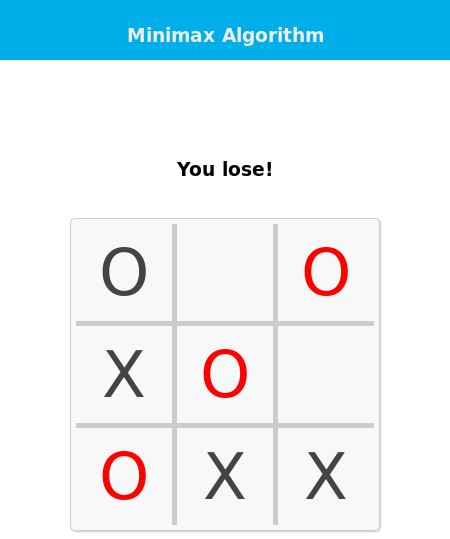
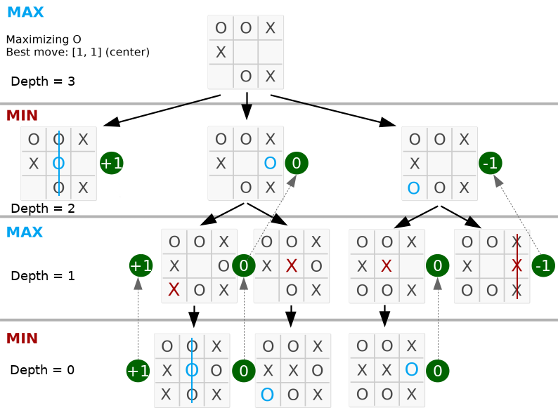
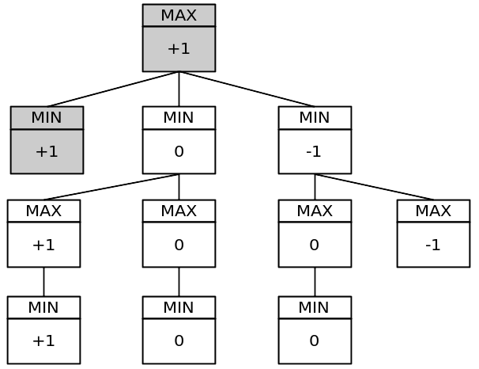

# Lovish-Gupta-TIC-TAC-TOE-MINMAX

An implementation of Minimax AI Algorithm on Tic-Tac-Toe (or Noughts and Crosses) game. Try it: [Tic-tac-toe - Minimax](https://lovish-gupta.github.io/Lovish-Gupta-TIC-TAC-TOE-MINMAX/)

<p align="center">
	</img>
</p>

## Introduction
To solve games using AI, we will introduce the concept of a game tree followed by minimax algorithm. The different states of the game are represented by nodes in the game tree, very similar to the above planning problems. The idea is just slightly different. In the game tree, the nodes are arranged in levels that correspond to each player's turns in the game so that the “root” node of the tree (usually depicted at the top of the diagram) is the beginning position in the game. In tic-tac-toe, this would be the empty grid with no Xs or Os played yet. Under root, on the second level, there are the possible states that can result from the first player’s moves, be it X or O. We call these nodes the “children” of the root node.

Each node on the second level, would further have as its children nodes the states that can be reached from it by the opposing player's moves. This is continued, level by level, until reaching states where the game is over. In tic-tac-toe, this means that either one of the players gets a line of three and wins, or the board is full and the game ends in a tie.

## What is Minimax?
Minimax is a artificial intelligence applied in two player games, such as tic-tac-toe, checkers, chess and go. This games are known as zero-sum games, because in a mathematical representation: one player wins (+1) and other player loses (-1) or both of anyone not to win (0).

## How does it works?
The algorithm search, recursively, the best move that leads the *Max* player to win or not lose (draw). It consider the current state of the game and the available moves at that state, then for each valid move it plays (alternating *min* and *max*) until it finds a terminal state (win, draw or lose).

## Understanding the Algorithm
The algorithm was studied by the book Algorithms in a Nutshell (George Heineman; Gary Pollice; Stanley Selkow, 2009). Pseudocode (adapted):

```
function minimax(state, depth, player) {
	var best;

	if (player == COMP) {
		best = [-1, -1, -1000];
	}
	else {
		best = [-1, -1, +1000];
	}

	if (depth == 0 || gameOverAll(state)) {
		var score = evalute(state);
		return [-1, -1, score];
	}

	emptyCells(state).forEach(function (cell) {
		var x = cell[0];
		var y = cell[1];
		state[x][y] = player;
		var score = minimax(state, depth - 1, -player);
		state[x][y] = 0;
		score[0] = x;
		score[1] = y;

		if (player == COMP) {
			if (score[2] > best[2])
				best = score;
		}
		else {
			if (score[2] < best[2])
				best = score;
		}
	});

	return best;
}
```

Now we'll see each part of this pseudocode with Python implementation. The Python implementation is available at this repository. First of all, consider it:
> board = [
>	[0, 0, 0],
>	[0, 0, 0],
>	[0, 0, 0]
> ]

> MAX = +1

> MIN = -1

The MAX may be X or O and the MIN may be O or X, whatever. The board is 3x3.

```
function minimax(state, depth, player):
```
* **state**: the current board in tic-tac-toe (node)
* **depth**: index of the node in the game tree
* **player**: may be a *MAX* player or *MIN* player

```
if (player == COMP) {
	best = [-1, -1, -1000];
}
else {
	best = [-1, -1, +1000];
}
```

Both players start with your worst score. If player is MAX, its score is -infinity. Else if player is MIN, its score is +infinity. **Note:** *infinity* is an alias for inf (from math module, in Python).

The best move on the board is [-1, -1] (row and column) for all.

```
if (depth == 0 || gameOverAll(state)) {
	var score = evalute(state);
	return [-1, -1, score];
}
```

If the depth is equal zero, then the board hasn't new empty cells to play. Or, if a player wins, then the game ended for MAX or MIN. So the score for that state will be returned.

* If MAX won: return +1
* If MIN won: return -1
* Else: return 0 (draw)

Now we'll see the main part of this code that contains recursion.

```
emptyCells(state).forEach(function (cell) {
	var x = cell[0];
	var y = cell[1];
	state[x][y] = player;
	var score = minimax(state, depth - 1, -player);
	state[x][y] = 0;
	score[0] = x;
	score[1] = y;

	if (player == COMP) {
		if (score[2] > best[2])
			best = score;
	}
	else {
		if (score[2] < best[2])
			best = score;
	}
```

For each valid moves (empty cells):
* **x**: receives cell row index
* **y**: receives cell column index
* **state[x][y]**: it's like board[available_row][available_col] receives MAX or MIN player
* **score = minimax(state, depth - 1, -player)**:
  * state: is the current board in recursion;
  * depth -1: index of the next state;
  * -player: if a player is MAX (+1) will be MIN (-1) and vice versa.

The move (+1 or -1) on the board is undo and the row, column are collected.

The next step is compare the score with best.

```
if (player == COMP) {
	if (score[2] > best[2])
		best = score;
	}
	else {
		if (score[2] < best[2])
			best = score;
	}
```

For MAX player, a bigger score will be received. For a MIN player, a lower score will be received. And in the end, the best move is returned. Final algorithm:

```
function minimax(state, depth, player) {
	var best;

	if (player == COMP) {
		best = [-1, -1, -1000];
	}
	else {
		best = [-1, -1, +1000];
	}

	if (depth == 0 || gameOverAll(state)) {
		var score = evalute(state);
		return [-1, -1, score];
	}

	emptyCells(state).forEach(function (cell) {
		var x = cell[0];
		var y = cell[1];
		state[x][y] = player;
		var score = minimax(state, depth - 1, -player);
		state[x][y] = 0;
		score[0] = x;
		score[1] = y;

		if (player == COMP) {
			if (score[2] > best[2])
				best = score;
		}
		else {
			if (score[2] < best[2])
				best = score;
		}
	});

	return best;
}
```

## Game Tree
Below, the best move is on the middle because the max value is on 2nd node on left.

<p align="center">
	</img>
</p>

Take a look that the depth is equal the valid moves on the board. The complete code is available in **py_version/**.

Simplified game tree:

<p align="center">
	</img>
</p>

That tree has 11 nodes. The full game tree has 549.946 nodes! You can test it putting a static global variable in your program and incrementing it for each minimax function call per turn.

In a more complex game, such as chess, it's hard to search whole game tree. However, Alpha–beta Pruning is an optimization method to the minimax algorithm that allows us to disregard some branches in the search tree, because he cuts irrelevant nodes (subtrees) in search.
